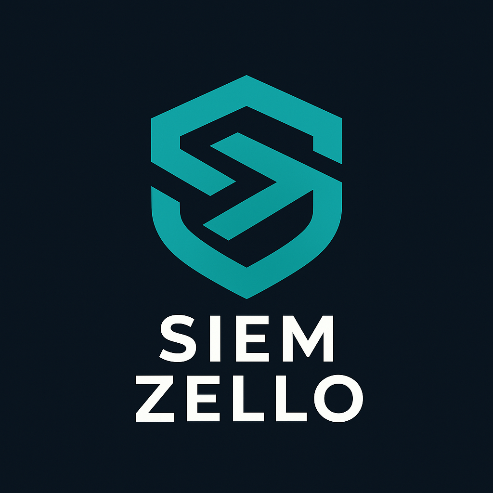

#   
> **AI-Powered Threat Detection SIEM System**  
> *"See Threats Before They Strike."*  

[](LICENSE)
[](https://www.python.org/)
[](https://github.com/SIEMZello/siemzello-core/graphs/contributors)

## Overview
**SIEMZello** is a next-generation SIEM platform that leverages AI to detect, analyze, and respond to security threats in real time. Designed for scalability, it ingests logs from diverse sources, correlates events using machine learning, and provides actionable insights via an intuitive dashboard.

---

## Key Features
| Feature | Description |
|---------|-------------|
| **Real-Time Log Ingestion** | Collect logs from servers, firewalls, and endpoints via OpenTelemetry and Kafka. |
| **AI Threat Detection** | Anomaly detection using Isolation Forest and LSTM models. |
| **Modular Architecture** | Plug-and-play components for logs, AI, and alerting. |
| **FastAPI Backend** | RESTful APIs for log queries, alerts, and integrations. |
| **Next.js Dashboard** | Real-time visualizations of threats and incidents. |
| **Multi-Channel Alerts** | Notifications via Slack, Email, and webhooks. |
| **Cloud-Native** | Containerized with Docker and deployable on Kubernetes. |

---

## Technologies
**Backend**:  
  
**Frontend**:  
  
**Data Pipeline**:  
  
**Database**:  
  
**AI/ML**:  
  

---

## Quick Start
### Prerequisites
- Python 3.10+, Docker, PostgreSQL
```bash
git clone https://github.com/SIEMZello/siemzello-core.git
cd siemzello-core
pip install -r requirements.txt
docker-compose up -d  # Starts Kafka + PostgreSQL
# Run the core engine
uvicorn main:app --reload  # FastAPI backend
cd frontend && npm run dev  # Next.js dashboard
```

## Team Roles
| Name | Role | Responsibilities |
|------|------|------------------|
| Rayen Hamza | Data Engineer | Set up log collection pipeline using OpenTelemetry, Kafka, and ELK |
| Hamza Badreddine | AI Engineer | Design and train models for detecting security anomalies |
| Youssef Charfeddine | Backend Developer | Build FastAPI backend with APIs for log queries and alerts |
| Youssef Hamdani | Frontend Developer | Build SIEM dashboard for real-time visualization and incident tracking |

## License
MIT © 2024 [SIEMZello Team](#).
`"Security Simplified."`